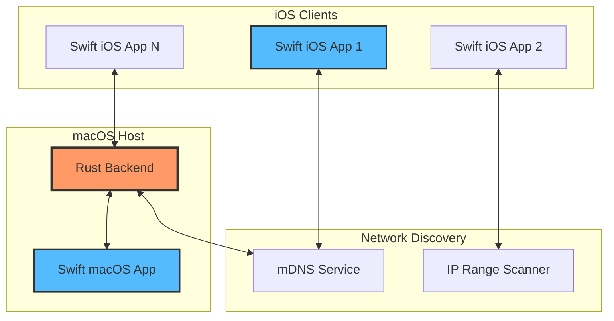

# 🌟 Librorum - Next-Generation Distributed File System
*高性能分布式文件系统 · High-Performance Distributed File System*

<div align="center">

[](https://www.rust-lang.org/)
[](https://swift.org/)
[](https://developer.apple.com/)
[](LICENSE)
[](#)
[](#ai-development-notice)

*🌐 [English](#english) | [中文](#中文)*

**Revolutionizing distributed storage with cutting-edge technology**

</div>

---

## 🤖 AI Development Notice

> **⚠️ 重要说明**: 本项目是一个**完全由 Claude 4 AI 自主编写**的测试项目，**无任何人工参与编码**。这是对 AI 自主软件开发能力的技术验证实验。
> 
> **⚠️ Important Notice**: This project is **entirely written autonomously by Claude 4 AI** with **zero human coding involvement**. This serves as a technical validation experiment for AI autonomous software development capabilities.

**🎯 实验目标 | Experiment Goals:**
- 验证 AI 能否独立完成复杂软件架构设计
- 测试 AI 在多语言项目中的代码生成能力  
- 探索 AI 自主问题解决和性能优化能力
- 建立 AI 软件开发的质量基准

**📋 当前任务 | Current Tasks:**
- [🚀 **性能优化 TODO**](PERFORMANCE_OPTIMIZATION_TODO.md) - 目标达到原生Rust I/O性能 (1,562MB/s写入, 7,142MB/s读取)

---

## 🇨🇳 中文

### 🚀 项目概述

**Librorum** 是一款革命性的开源分布式文件系统，融合了 **Rust** 的极致性能与 **Swift** 的优雅设计。采用创新的双架构设计，为现代跨平台应用提供企业级的文件存储、管理和同步解决方案。

### ✨ 核心特性

#### 🏗️ **双架构设计**
- **🖥️ macOS 主机模式**: 完整的后端服务 + 原生 UI
- **📱 iOS 客户端模式**: 智能网络发现 + 云端连接

#### ⚡ **高性能核心**
- **零拷贝数据传输**: 基于 gRPC 的高效通信协议
- **智能缓存策略**: LRU + 磁盘缓存双重优化
- **并发文件处理**: Rust 异步运行时保障极致性能

#### 🔐 **企业级安全**
- **端到端加密**: AES-256 + HKDF 密钥派生
- **权限精细控制**: 基于角色的访问控制 (RBAC)
- **网络安全**: mTLS 双向认证

#### 🌐 **智能网络**
- **自动服务发现**: mDNS + IP 范围扫描
- **负载均衡**: 智能节点选择算法
- **故障恢复**: 自动故障检测与恢复

### 🎯 技术亮点

#### **Rust 后端核心**
```rust
// 高性能异步文件处理
pub struct VirtualFileSystem {
    cache: Arc<CacheManager>,
    storage: Arc<dyn StorageBackend>,
    metadata: Arc<MetadataManager>,
}

// 零拷贝数据传输
impl FileService for VirtualFileSystem {
    async fn read_chunk(&self, request: ChunkRequest) -> Result<ChunkResponse> {
        // 直接内存映射，无数据拷贝
        self.storage.read_mapped(request.offset, request.size).await
    }
}
```

#### **Swift 客户端架构**
```swift
// 现代 SwiftUI + Observation 框架
@Observable
class CoreManager {
    var backendStatus: BackendStatus = .stopped
    var connectedNodes: [NodeInfo] = []
    
    // iOS 智能网络发现
    #if os(iOS)
    func scanAndConnectToExistingCore() async throws {
        // mDNS 发现 + IP 扫描备用
    }
    #endif
}
```

### 📋 系统架构



### 📁 项目结构

```
librorum/
├── 🗂️ shared/                  # 共享库 (gRPC协议、配置管理、工具函数)
│   ├── src/
│   │   ├── 🔌 proto/            # gRPC 协议定义
│   │   ├── 🔧 config.rs         # 配置管理
│   │   └── 🛠️ utils.rs          # 通用工具函数
│   └── 📦 Cargo.toml
├── 🦀 core/                     # Rust 高性能守护进程
│   ├── src/
│   │   ├── 🎯 main.rs           # 守护进程入口
│   │   ├── ⚙️ daemon.rs         # 跨平台守护进程
│   │   ├── 📊 logger.rs         # 结构化日志系统
│   │   ├── 🌐 node_manager/     # 分布式节点管理
│   │   └── 💾 vdfs/             # 虚拟分布式文件系统
│   └── 📦 Cargo.toml
├── 💻 cli/                      # 命令行客户端 (gRPC通信)
│   ├── src/
│   │   ├── 🎯 main.rs           # CLI入口
│   │   └── 📚 lib.rs            # 核心功能库
│   └── 📦 Cargo.toml
├── 🍎 client/librorum/          # Swift 跨平台客户端
│   ├── 🎨 Views/                # SwiftUI 界面组件
│   ├── 🗂️ Models/              # SwiftData 数据模型
│   ├── ⚡ Services/             # 业务逻辑服务
│   ├── 🔧 Utilities/           # 工具函数
│   └── 🖥️ Core/                # gRPC 通信核心
├── 📚 docs/                     # 完整技术文档
├── 🧪 examples/                 # 示例代码
└── 📄 *.md                     # 项目文档
```

### 🛠️ 快速开始

#### 📋 环境要求
- **Rust**: 2024 Edition
- **Swift**: 5.9+
- **系统**: macOS 14+ / iOS 17+
- **Xcode**: 15.0+

#### 🔨 构建步骤

**1. 构建所有组件**
```bash
# 构建所有Rust组件（共享库、守护进程、CLI）
cargo build --release

# 开发调试版本  
cargo build

# 单独构建组件
cargo build -p librorum-shared    # 构建共享库
cargo build -p librorum-core      # 构建核心守护进程
cargo build -p librorum-cli       # 构建命令行客户端
```

**2. Swift客户端构建**
```bash
# Xcode 构建
open client/librorum.xcodeproj

# 命令行构建
xcodebuild -scheme librorum -destination "platform=macOS" build
xcodebuild -scheme librorum -destination "platform=iOS,name=iPhone" build
```

#### 🚀 服务启动

```bash
# 初始化配置
./target/release/librorum init

# 启动核心守护进程（直接启动）
./target/release/librorum-core --config librorum.toml

# 或通过CLI管理守护进程
./target/release/librorum start --config librorum.toml

# 实时状态监控
./target/release/librorum status

# 查看结构化日志
./target/release/librorum logs --tail 50

# 网络节点状态
./target/release/librorum nodes-status
```

### ⚙️ 高级配置

```toml
[node]
bind_host = "0.0.0.0"
bind_port = 50051
node_prefix = "librorum-node"

[logging]
level = "info"                    # trace, debug, info, warn, error
format = "json"                   # json, pretty, compact
rotation = "daily"                # daily, hourly, size-based

[storage]
data_dir = "~/Library/Application Support/librorum"
chunk_size = 1048576             # 1MB chunks
replication_factor = 3           # 3x data redundancy
compression = "zstd"             # zstd, lz4, gzip

[network]
heartbeat_interval = 30          # seconds
discovery_interval = 60          # seconds
max_connections = 100
timeout = 30000                  # milliseconds

[security]
enable_encryption = true
key_derivation = "hkdf-sha256"
cipher = "aes-256-gcm"

[performance]
cache_size = "512MB"
max_concurrent_operations = 64
prefetch_enabled = true
```

### 📚 完整文档

#### 🏗️ **架构设计**
- [📖 CLAUDE.md](CLAUDE.md) - Claude AI 协作指南
- [🎯 PROJECT_REFERENCE.md](PROJECT_REFERENCE.md) - 项目技术参考
- [🎨 UI_BACKEND_LAUNCH_DESIGN.md](UI_BACKEND_LAUNCH_DESIGN.md) - UI/后端启动设计

#### 🧪 **测试文档**  
- [✅ TESTING_GUIDE.md](librorum/TESTING_GUIDE.md) - 完整测试指南
- [📊 FINAL_TEST_STATUS.md](librorum/FINAL_TEST_STATUS.md) - 测试状态报告
- [📋 TESTING_SUMMARY_FINAL.md](TESTING_SUMMARY_FINAL.md) - 测试总结
- [🔬 core/TESTING_SUMMARY.md](core/TESTING_SUMMARY.md) - 核心测试摘要

#### 📋 **项目管理**
- [🚀 **PERFORMANCE_OPTIMIZATION_TODO.md**](PERFORMANCE_OPTIMIZATION_TODO.md) - **性能优化路线图** (达到原生Rust I/O性能)
- [✅ PROJECT_TODO.md](PROJECT_TODO.md) - 开发任务清单
- [🚀 IMMEDIATE_ACTIONS.md](librorum/IMMEDIATE_ACTIONS.md) - 即时行动计划
- [📈 EVALUATION_ANALYSIS.md](EVALUATION_ANALYSIS.md) - 项目评估分析

#### 🔬 **技术深度**
- [⚡ metadata_performance_comparison.md](core/docs/metadata_performance_comparison.md) - 元数据性能对比
- [🏗️ core/README.md](core/README.md) - 核心架构详解

### 🌟 特色功能

#### 🎨 **现代化 UI**
- **响应式设计**: 自适应 iPhone/iPad/Mac 布局
- **深色模式**: 完美支持系统外观切换  
- **流畅动画**: 120fps 丝滑交互体验
- **无障碍支持**: 完整 VoiceOver 适配

#### 📊 **实时监控**
- **性能仪表板**: CPU/内存/网络实时监控
- **日志管理**: 结构化日志查看与导出
- **节点拓扑**: 可视化网络节点关系
- **健康检查**: 自动故障检测与报警

#### 🔧 **开发者友好**
- **热重载**: 配置修改无需重启
- **API 文档**: 完整 gRPC API 参考
- **调试模式**: 详细的错误跟踪
- **扩展接口**: 插件化架构设计

---

## 🇺🇸 English

### 🚀 Project Overview

**Librorum** is a revolutionary open-source distributed file system that combines **Rust's** ultimate performance with **Swift's** elegant design. Featuring an innovative dual-architecture approach, it provides enterprise-grade file storage, management, and synchronization solutions for modern cross-platform applications.

### ✨ Core Features

#### 🏗️ **Dual Architecture Design**
- **🖥️ macOS Host Mode**: Complete backend services + native UI
- **📱 iOS Client Mode**: Intelligent network discovery + cloud connectivity

#### ⚡ **High-Performance Core**
- **Zero-Copy Data Transfer**: Efficient gRPC-based communication protocol
- **Smart Caching Strategy**: LRU + disk cache dual optimization
- **Concurrent File Processing**: Rust async runtime ensures ultimate performance

#### 🔐 **Enterprise-Grade Security**
- **End-to-End Encryption**: AES-256 + HKDF key derivation
- **Fine-Grained Permissions**: Role-Based Access Control (RBAC)
- **Network Security**: mTLS mutual authentication

#### 🌐 **Intelligent Networking**
- **Automatic Service Discovery**: mDNS + IP range scanning
- **Load Balancing**: Smart node selection algorithms
- **Fault Recovery**: Automatic failure detection and recovery

### 🎯 Technical Highlights

#### **Rust Backend Core**
```rust
// High-performance async file processing
pub struct VirtualFileSystem {
    cache: Arc<CacheManager>,
    storage: Arc<dyn StorageBackend>,
    metadata: Arc<MetadataManager>,
}

// Zero-copy data transfer
impl FileService for VirtualFileSystem {
    async fn read_chunk(&self, request: ChunkRequest) -> Result<ChunkResponse> {
        // Direct memory mapping, no data copying
        self.storage.read_mapped(request.offset, request.size).await
    }
}
```

#### **Swift Client Architecture**
```swift
// Modern SwiftUI + Observation framework
@Observable
class CoreManager {
    var backendStatus: BackendStatus = .stopped
    var connectedNodes: [NodeInfo] = []
    
    // iOS intelligent network discovery
    #if os(iOS)
    func scanAndConnectToExistingCore() async throws {
        // mDNS discovery + IP scanning fallback
    }
    #endif
}
```

### 📋 System Architecture


### 📁 Project Structure

```
librorum/
├── 🗂️ shared/                  # Shared library (gRPC protocols, config, utilities)
│   ├── src/
│   │   ├── 🔌 proto/            # gRPC protocol definitions
│   │   ├── 🔧 config.rs         # Configuration management
│   │   └── 🛠️ utils.rs          # Common utility functions
│   └── 📦 Cargo.toml
├── 🦀 core/                     # Rust high-performance daemon
│   ├── src/
│   │   ├── 🎯 main.rs           # Daemon entry point
│   │   ├── ⚙️ daemon.rs         # Cross-platform daemon
│   │   ├── 📊 logger.rs         # Structured logging system
│   │   ├── 🌐 node_manager/     # Distributed node management
│   │   └── 💾 vdfs/             # Virtual Distributed File System
│   └── 📦 Cargo.toml
├── 💻 cli/                      # Command-line client (gRPC communication)
│   ├── src/
│   │   ├── 🎯 main.rs           # CLI entry point
│   │   └── 📚 lib.rs            # Core functionality library
│   └── 📦 Cargo.toml
├── 🍎 client/librorum/          # Swift cross-platform client
│   ├── 🎨 Views/                # SwiftUI interface components
│   ├── 🗂️ Models/              # SwiftData data models
│   ├── ⚡ Services/             # Business logic services
│   ├── 🔧 Utilities/           # Utility functions
│   └── 🖥️ Core/                # gRPC communication core
├── 📚 docs/                     # Complete technical documentation
├── 🧪 examples/                 # Example code
└── 📄 *.md                     # Project documentation
```

### 🛠️ Quick Start

#### 📋 Requirements
- **Rust**: 2024 Edition
- **Swift**: 5.9+
- **System**: macOS 14+ / iOS 17+
- **Xcode**: 15.0+

#### 🔨 Build Steps

**1. Build All Components**
```bash
# Build all Rust components (shared library, daemon, CLI)
cargo build --release

# Development debug build  
cargo build

# Build individual components
cargo build -p librorum-shared    # Build shared library
cargo build -p librorum-core      # Build core daemon
cargo build -p librorum-cli       # Build command-line client
```

**2. Swift Client Build**
```bash
# Xcode build
open client/librorum.xcodeproj

# Command line build
xcodebuild -scheme librorum -destination "platform=macOS" build
xcodebuild -scheme librorum -destination "platform=iOS,name=iPhone" build
```

#### 🚀 Service Launch

```bash
# Initialize configuration
./target/release/librorum init

# Start core daemon (direct launch)
./target/release/librorum-core --config librorum.toml

# Or manage daemon through CLI
./target/release/librorum start --config librorum.toml

# Real-time status monitoring
./target/release/librorum status

# View structured logs
./target/release/librorum logs --tail 50

# Network node status
./target/release/librorum nodes-status
```

### ⚙️ Advanced Configuration

```toml
[node]
bind_host = "0.0.0.0"
bind_port = 50051
node_prefix = "librorum-node"

[logging]
level = "info"                    # trace, debug, info, warn, error
format = "json"                   # json, pretty, compact
rotation = "daily"                # daily, hourly, size-based

[storage]
data_dir = "~/Library/Application Support/librorum"
chunk_size = 1048576             # 1MB chunks
replication_factor = 3           # 3x data redundancy
compression = "zstd"             # zstd, lz4, gzip

[network]
heartbeat_interval = 30          # seconds
discovery_interval = 60          # seconds
max_connections = 100
timeout = 30000                  # milliseconds

[security]
enable_encryption = true
key_derivation = "hkdf-sha256"
cipher = "aes-256-gcm"

[performance]
cache_size = "512MB"
max_concurrent_operations = 64
prefetch_enabled = true
```

### 📚 Complete Documentation

#### 🏗️ **Architecture Design**
- [📖 CLAUDE.md](CLAUDE.md) - Claude AI Collaboration Guide
- [🎯 PROJECT_REFERENCE.md](PROJECT_REFERENCE.md) - Project Technical Reference
- [🎨 UI_BACKEND_LAUNCH_DESIGN.md](UI_BACKEND_LAUNCH_DESIGN.md) - UI/Backend Launch Design

#### 🧪 **Testing Documentation**  
- [✅ TESTING_GUIDE.md](librorum/TESTING_GUIDE.md) - Complete Testing Guide
- [📊 FINAL_TEST_STATUS.md](librorum/FINAL_TEST_STATUS.md) - Test Status Report
- [📋 TESTING_SUMMARY_FINAL.md](TESTING_SUMMARY_FINAL.md) - Testing Summary
- [🔬 core/TESTING_SUMMARY.md](core/TESTING_SUMMARY.md) - Core Testing Summary

#### 📋 **Project Management**
- [🚀 **PERFORMANCE_OPTIMIZATION_TODO.md**](PERFORMANCE_OPTIMIZATION_TODO.md) - **Performance Optimization Roadmap** (Target: Native Rust I/O Performance)
- [✅ PROJECT_TODO.md](PROJECT_TODO.md) - Development Task List
- [🚀 IMMEDIATE_ACTIONS.md](librorum/IMMEDIATE_ACTIONS.md) - Immediate Action Plan
- [📈 EVALUATION_ANALYSIS.md](EVALUATION_ANALYSIS.md) - Project Evaluation Analysis

#### 🔬 **Technical Deep Dive**
- [⚡ metadata_performance_comparison.md](core/docs/metadata_performance_comparison.md) - Metadata Performance Comparison
- [🏗️ core/README.md](core/README.md) - Core Architecture Details

### 🌟 Signature Features

#### 🎨 **Modern UI**
- **Responsive Design**: Adaptive iPhone/iPad/Mac layouts
- **Dark Mode**: Perfect system appearance switching support  
- **Fluid Animations**: 120fps silky smooth interactions
- **Accessibility**: Complete VoiceOver support

#### 📊 **Real-time Monitoring**
- **Performance Dashboard**: Real-time CPU/memory/network monitoring
- **Log Management**: Structured log viewing and export
- **Node Topology**: Visual network node relationships
- **Health Checks**: Automatic failure detection and alerts

#### 🔧 **Developer Friendly**
- **Hot Reload**: Configuration changes without restart
- **API Documentation**: Complete gRPC API reference
- **Debug Mode**: Detailed error tracking
- **Extension Interface**: Plugin-based architecture design

---

## 🎯 Development Roadmap

### Phase 1: Foundation ✅
- [x] Cross-platform dual architecture
- [x] gRPC communication protocol
- [x] Basic file operations
- [x] Network discovery system

### Phase 2: Enhancement 🚧
- [ ] Advanced encryption features
- [ ] Real-time synchronization
- [ ] Performance optimization
- [ ] Extended platform support

### Phase 3: Enterprise 📋
- [ ] Multi-tenant support
- [ ] Advanced analytics
- [ ] Cloud integration
- [ ] Professional deployment tools

---

## 🤝 Contributing

We welcome contributions from developers worldwide! Here's how you can help:

### 🐛 Bug Reports
- Use our [issue templates](.github/ISSUE_TEMPLATE/)
- Provide detailed reproduction steps
- Include system information and logs

### 🔧 Development
- Fork the repository
- Create feature branches
- Follow our coding standards
- Submit comprehensive pull requests

### 📖 Documentation
- Improve existing documentation
- Add new guides and tutorials
- Translate documentation

---

## 📄 License

This project is licensed under the MIT License - see the [LICENSE](LICENSE) file for details.

---

## 🌟 Acknowledgments

- **Rust Community** - For the amazing async ecosystem
- **Swift Team** - For the revolutionary SwiftUI framework
- **gRPC Project** - For the robust communication protocol
- **Contributors** - Everyone who helped build this project

---

<div align="center">

**Built with ❤️ by the Librorum Team**

[🌟 Star us on GitHub](https://github.com/Gyangu/librorum) | [📋 Report Issues](https://github.com/Gyangu/librorum/issues) | [💬 Join Discussions](https://github.com/Gyangu/librorum/discussions)

</div>